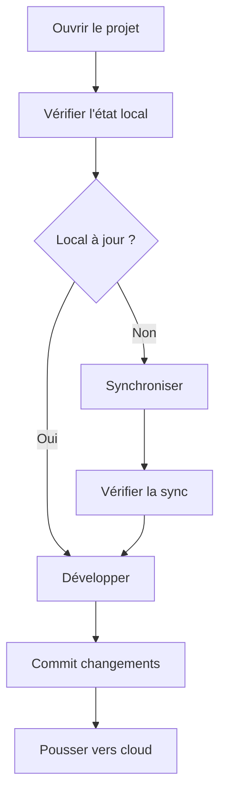

# Guide de Synchronisation Cloud-First

> **Guide ultra-complet pour maintenir votre environnement local synchronisé avec Supabase Cloud**

## 🎯 Objectif de ce Guide

Ce document explique **exactement** comment synchroniser votre repository local quand :

- Vous n'avez pas travaillé sur votre PC pendant plusieurs jours
- Votre base de données cloud Supabase a changé (migrations, données, schéma)
- Vous voulez toujours savoir si votre environnement local est à jour

**⚠️ Important :** Ce guide est conçu pour une approche **cloud-first** sans CI/CD payant.

## 📋 Vue d'Ensemble du Workflow



## 🚀 Commandes de Synchronisation

### 📥 Scripts Ajoutés au package.json

```json
{
  "scripts": {
    "db:status": "supabase status --linked",
    "db:check": "node scripts/check-db-sync.js",
    "db:pull": "supabase db pull --linked",
    "db:push": "supabase db push --linked",
    "db:sync": "run-s db:pull types:gen db:check",
    "db:reset-local": "supabase db reset --linked",
    "migration:list": "supabase migration list --linked",
    "migration:status": "node scripts/migration-status.js",
    "types:gen": "supabase gen types --lang=typescript --schema=public --linked > apps/frontend/src/types/database.types.ts",
    "types:check": "node scripts/check-types-sync.js",
    "sync:full": "run-s db:sync types:check",
    "sync:check": "run-s db:check types:check migration:status"
  }
}
```

## 🔍 Étape 1 : Vérification de l'État Initial

### Quand vous ouvrez le projet après quelques jours :

```bash
# 1. Vérifier le statut git
git status
git pull origin main

# 2. Installer les dépendances (au cas où)
pnpm install

# 3. Vérifier la connexion Supabase
pnpm db:status
```

**Ce que fait `pnpm db:status` :**

- Se connecte à votre projet Supabase cloud
- Affiche l'état des services (API, Auth, Storage, etc.)
- Confirme que votre CLI est bien lié au bon projet cloud

### 🔍 Diagnostic Complet

```bash
# 4. Vérifier l'état de synchronisation complet
pnpm sync:check
```

**Ce que fait `pnpm sync:check` :**

1. **`db:check`** - Compare les migrations locales vs cloud
2. **`types:check`** - Vérifie si les types TS sont à jour
3. **`migration:status`** - Liste l'état de chaque migration

## 🔄 Étape 2 : Synchronisation (si nécessaire)

### Si des changements sont détectés :

```bash
# Synchronisation complète automatique
pnpm sync:full
```

**Ce que fait `pnpm sync:full` :**

1. **`db:pull`** - Télécharge les nouvelles migrations depuis le cloud
2. **`types:gen`** - Régénère les types TypeScript depuis le schéma cloud
3. **`types:check`** - Vérifie que les types sont cohérents

### Ou synchronisation manuelle étape par étape :

```bash
# 1. Récupérer les migrations cloud
pnpm db:pull

# 2. Régénérer les types TypeScript
pnpm types:gen

# 3. Vérifier que tout est synchronisé
pnpm db:check
```

## 📊 Détail des Commandes

### `pnpm db:status`

```bash
# Affiche l'état complet de votre projet Supabase cloud
# ✅ API: http://your-project.supabase.co (UP)
# ✅ Auth: http://your-project.supabase.co/auth/v1 (UP)
# ✅ Storage: http://your-project.supabase.co/storage/v1 (UP)
# 📊 Database: PostgreSQL 15.1 (UP)
```

### `pnpm db:check`

```bash
# Script personnalisé qui vérifie :
# - Migrations locales vs cloud
# - Schéma de base cohérent
# - Dernière modification des tables
#
# Sortie exemple :
# ✅ Local migrations: 5
# ✅ Remote migrations: 5
# ✅ Database schema: SYNCHRONIZED
# 🕐 Last sync: 2024-01-15 14:30:22
```

### `pnpm db:pull`

```bash
# Télécharge TOUTES les nouvelles migrations depuis le cloud
# Crée des fichiers dans apps/backend/supabase/migrations/
# ⚠️ NE modifie PAS les données locales, juste les fichiers de migration
```

### `pnpm types:gen`

```bash
# Génère apps/frontend/src/types/database.types.ts depuis le schéma cloud
# Inclut toutes les tables, vues, fonctions, enums
# Types automatiquement synchronisés avec votre DB cloud
```

### `pnpm migration:status`

```bash
# Script qui liste le statut de chaque migration :
# ✅ 20240112_initial_schema.sql (applied)
# ✅ 20240113_add_users.sql (applied)
# ❌ 20240115_add_courses.sql (pending)
# 🔄 20240116_update_auth.sql (local only)
```

## 🛠 Scripts de Vérification Personnalisés

### Script `check-db-sync.js`

```javascript
// scripts/check-db-sync.js
const { execSync } = require('child_process');
const fs = require('fs');

async function checkDatabaseSync() {
  try {
    console.log('🔍 Vérification de la synchronisation DB...');

    // Comparer les migrations locales vs cloud
    const localMigrations = fs
      .readdirSync('apps/backend/supabase/migrations')
      .filter(file => file.endsWith('.sql'));

    const remoteMigrations = execSync('supabase migration list --linked', { encoding: 'utf8' });

    console.log(`📂 Migrations locales: ${localMigrations.length}`);
    console.log(`☁️  Migrations cloud: ${remoteMigrations.split('\n').length - 1}`);

    // Vérifier les types TypeScript
    const typesFile = 'apps/frontend/src/types/database.types.ts';
    const typesStats = fs.statSync(typesFile);
    const hoursOld = (Date.now() - typesStats.mtime.getTime()) / (1000 * 60 * 60);

    if (hoursOld > 24) {
      console.log('⚠️  Types TypeScript datent de plus de 24h');
      console.log('💡 Exécutez: pnpm types:gen');
    } else {
      console.log('✅ Types TypeScript récents');
    }
  } catch (error) {
    console.error('❌ Erreur lors de la vérification:', error.message);
    process.exit(1);
  }
}

checkDatabaseSync();
```

### Script `migration-status.js`

```javascript
// scripts/migration-status.js
const { execSync } = require('child_process');
const fs = require('fs');
const path = require('path');

function getMigrationStatus() {
  console.log('📋 Statut des migrations:\n');

  try {
    // Lister les migrations locales
    const migrationsDir = 'apps/backend/supabase/migrations';
    const localFiles = fs
      .readdirSync(migrationsDir)
      .filter(file => file.endsWith('.sql'))
      .sort();

    // Obtenir le statut depuis Supabase
    const remoteStatus = execSync('supabase migration list --linked', { encoding: 'utf8' });
    const appliedMigrations = remoteStatus
      .split('\n')
      .filter(line => line.includes('Applied'))
      .map(line => line.split('|')[1]?.trim());

    localFiles.forEach(file => {
      const fileName = path.parse(file).name;
      const isApplied = appliedMigrations.some(applied => applied?.includes(fileName));
      const status = isApplied ? '✅ Applied' : '⏳ Pending';
      console.log(`${status} ${file}`);
    });
  } catch (error) {
    console.error('❌ Erreur:', error.message);
  }
}

getMigrationStatus();
```

### Script `check-types-sync.js`

```javascript
// scripts/check-types-sync.js
const fs = require('fs');
const { execSync } = require('child_process');

function checkTypesSync() {
  console.log('🔍 Vérification des types TypeScript...');

  try {
    const typesFile = 'apps/frontend/src/types/database.types.ts';

    if (!fs.existsSync(typesFile)) {
      console.log('❌ Fichier de types manquant');
      console.log('💡 Exécutez: pnpm types:gen');
      return;
    }

    const stats = fs.statSync(typesFile);
    const content = fs.readFileSync(typesFile, 'utf8');

    // Vérifier la date de modification
    const hoursOld = (Date.now() - stats.mtime.getTime()) / (1000 * 60 * 60);

    // Vérifier si le contenu semble valide
    const hasExports = content.includes('export type Database');
    const hasTables = content.includes('Tables:');

    if (!hasExports || !hasTables) {
      console.log('❌ Types corrompus ou invalides');
      console.log('💡 Exécutez: pnpm types:gen');
      return;
    }

    if (hoursOld > 24) {
      console.log(`⚠️  Types datent de ${Math.round(hoursOld)}h`);
      console.log('💡 Considérez: pnpm types:gen');
    } else {
      console.log('✅ Types à jour');
    }

    console.log(`📅 Dernière modification: ${stats.mtime.toLocaleString()}`);
  } catch (error) {
    console.error('❌ Erreur:', error.message);
  }
}

checkTypesSync();
```

## 🚨 Situations de Désynchronisation

### Cas 1 : Nouvelles Migrations dans le Cloud

**Symptômes :**

- Erreurs TypeScript sur les nouveaux types de DB
- Requêtes Supabase qui échouent
- Tables/colonnes manquantes

**Solution :**

```bash
pnpm db:pull      # Récupère les nouvelles migrations
pnpm types:gen    # Régénère les types
pnpm db:check     # Vérifie la synchronisation
```

### Cas 2 : Modifications de Schéma Non Appliquées

**Symptômes :**

- `pnpm db:check` montre des différences
- Les types TypeScript ne correspondent pas

**Solution :**

```bash
pnpm db:push      # Pousse vos migrations locales vers le cloud
pnpm types:gen    # Régénère les types depuis le cloud
```

### Cas 3 : Conflit de Migrations

**Symptômes :**

- Erreurs lors de `db:pull` ou `db:push`
- Migrations en conflit

**Solution :**

```bash
# Option 1: Reset local et resync
pnpm db:reset-local
pnpm db:pull
pnpm types:gen

# Option 2: Résolution manuelle
# 1. Examiner les conflits dans apps/backend/supabase/migrations/
# 2. Résoudre manuellement
# 3. Pousser les changements
pnpm db:push
```

### Cas 4 : Types TypeScript Corrompus

**Symptômes :**

- Erreurs de compilation TypeScript
- Types manquants ou incorrects

**Solution :**

```bash
rm apps/frontend/src/types/database.types.ts
pnpm types:gen
pnpm typecheck
```

## ⚡ Workflow Quotidien Recommandé

### 🌅 Début de Journée

```bash
# 1. Récupérer les derniers changements git
git pull origin main

# 2. Vérifier l'état de synchronisation
pnpm sync:check

# 3. Si des changements détectés, synchroniser
pnpm sync:full

# 4. Démarrer le développement
pnpm dev
```

### 💻 Pendant le Développement

```bash
# À chaque modification de schéma DB :
pnpm types:gen

# Avant chaque commit :
pnpm lint
pnpm typecheck
pnpm test
```

### 🌙 Fin de Journée

```bash
# 1. Pousser les migrations vers le cloud (si applicable)
pnpm db:push

# 2. Commit des changements
git add .
git commit -m "feat: description des changements"
git push origin main

# 3. Vérification finale
pnpm sync:check
```

## 🔧 Configuration du Projet

### Variables d'Environnement Nécessaires

```env
# .env - Variables pour la synchronisation cloud
SUPABASE_URL=https://your-project.supabase.co
SUPABASE_ANON_KEY=eyJ...
SUPABASE_SERVICE_ROLE_KEY=eyJ...
SUPABASE_ACCESS_TOKEN=sbp_...
SUPABASE_PROJECT_REF=your-project-ref
SUPABASE_DB_PASSWORD=your-db-password
```

### Lien CLI avec le Projet Cloud

```bash
# Une seule fois lors de la configuration initiale
supabase login
supabase link --project-ref your-project-ref
```

## 📈 Monitoring et Diagnostics

### Logs Supabase

```bash
# Voir les logs en temps réel
supabase logs --follow

# Logs spécifiques
supabase logs --type api        # Logs API
supabase logs --type postgres   # Logs DB
supabase logs --type auth       # Logs Auth
```

### Dashboard Supabase

**URL :** `https://supabase.com/dashboard/project/your-project-ref`

**Sections importantes :**

- **Table Editor** : État des données
- **SQL Editor** : Exécuter des requêtes
- **Logs** : Monitoring en temps réel
- **Settings > API** : Credentials

## 🚨 Dépannage

### Erreur "Project not linked"

```bash
supabase link --project-ref your-project-ref --password your-db-password
```

### Erreur "Migration conflict"

```bash
# Voir les migrations en conflit
pnpm migration:status

# Résoudre manuellement ou reset
pnpm db:reset-local
pnpm db:pull
```

### Types TypeScript invalides

```bash
# Vérifier la validité
pnpm types:check

# Régénérer complètement
rm apps/frontend/src/types/database.types.ts
pnpm types:gen
```

### Base de données non accessible

```bash
# Vérifier la connectivité
pnpm db:status

# Vérifier les credentials dans .env
```

## 📋 Checklist de Synchronisation

### ✅ Avant de Commencer le Travail

- [ ] `git pull origin main`
- [ ] `pnpm install`
- [ ] `pnpm sync:check`
- [ ] `pnpm sync:full` (si nécessaire)
- [ ] `pnpm dev` démarre sans erreur

### ✅ Pendant le Développement

- [ ] `pnpm types:gen` après chaque changement de schéma
- [ ] `pnpm typecheck` régulièrement
- [ ] `pnpm db:check` si doute sur la synchronisation

### ✅ Avant de Committer

- [ ] `pnpm lint` passe
- [ ] `pnpm typecheck` passe
- [ ] `pnpm test` passe
- [ ] `pnpm sync:check` confirme la synchronisation

### ✅ Après le Commit

- [ ] `git push origin main`
- [ ] `pnpm db:push` (si migrations locales)
- [ ] Vérifier sur le dashboard Supabase

## 🎯 Résumé

**L'objectif de ce système :**

1. **Toujours savoir** si votre environnement local est synchronisé
2. **Synchronisation en un clic** avec `pnpm sync:full`
3. **Diagnostics précis** avec `pnpm sync:check`
4. **Pas de surprises** lors du développement

**Commandes principales à retenir :**

- `pnpm sync:check` - Vérifier l'état
- `pnpm sync:full` - Synchroniser complètement
- `pnpm db:status` - État de la connexion cloud
- `pnpm types:gen` - Régénérer les types

**Philosophie cloud-first :**

- ☁️ Le cloud Supabase est la source de vérité
- 💻 Le local se synchronise avec le cloud
- 🔄 Synchronisation fréquente et automatisée
- 🎯 Développement sans friction

---

**🎉 Avec ce guide, vous ne perdrez plus jamais le contrôle de votre environnement de développement !**
